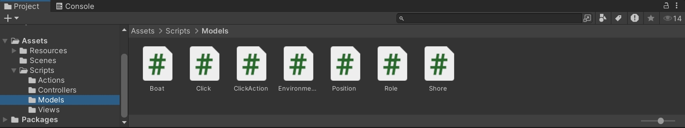

## lab05/06 Preists& Demons

采用Unity实现了《牧师与魔鬼》游戏。

> Priests and Devils
> Priests and Devils is a puzzle game in which you will help the Priests and Devils to cross the river within the time limit. There are 3 priests and 3 devils at one side of the river. They all want to get to the other side of this river, but there is only one boat and this boat can only carry two persons each time. And there must be one person steering the boat from one side to the other side. In the flash game, you can click on them to move them and click the go button to move the boat to the other direction. If the priests are out numbered by the devils on either side of the river, they get killed and the game is over. You can try it in many > ways. Keep all priests alive! Good luck!

演示视频：https://www.bilibili.com/video/BV1fJCfYjEx3

<video src="https://www.bilibili.com/video/BV1fJCfYjEx3"></video>

### 一 · 场景实现

使用自制预制与商店资源构建了游戏场景。

### 二 · 代码架构 

参考了[unity-3D/hw4/README.md at master · jiushiwola/unity-3D (github.com)](https://github.com/jiushiwola/unity-3D/blob/master/hw4/README.md)的实现，并有如下主要改进：

1. 修复了无法正常倒计时等若干bug，完善游戏功能。
2. 重新梳理代码逻辑，使架构更清晰明了。
3. 增加若干动作，丰富游戏体验。
4. 对UI界面作出调整，完善UI界面功能。

#### (1) Models

- 定义了若干类以包装`GameObject`，负责处理计算逻辑。
- 定义类`Click`用于处理鼠标点击事件。

#### (2) Controllers

- 通过定义`ISceneController`，`IUserController`等接口负责Models部件与Views部件的交互
- 由`FirstController`作为主控制器负责控制游戏流程，包括控制资源的加载与回收、结束条件判定等。
- 定义`JudgeController`作为裁判类，负责处理结束条件的判定逻辑。

#### (3) Views

- 由`UserGUI`类定义用户交互界面。

#### (4) Actions

在给出的示例代码上进行修改，实现动作管理与游戏场景的分离。

- 定义`SSAction`和`ISSActionCallback`作为动作基类和回调函数接口。在此基础上定义了`CCMoveToAction`、`CCRotateAction`等动作类。
- 定义`SSActionManager`作为动作管理者基类，负责控制待执行运动的列表。定义`CCActionManager`负责实现Models的运动。

